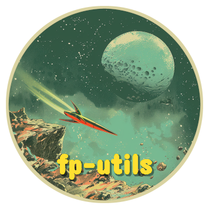

  

<h1 align="center">fp-utils&nbsp;&nbsp;</h1>

<b>Functional utility library for TypeScript&nbsp;&nbsp;&nbsp;&nbsp;

## Background

I have been exploring ways to represent Option and Result types in TypeScript
that would be intuitive to use and have idiomatic functionality, similar to how
promises and arrays are constructed and chained. This is the result of these
explorations—think of it as lodash, but with minimalistic utilities for
functional programming.

Fair warning, even though these concepts can be used without much knowledge
about functional programming. I wholeheartedly recommend to understand the
basics of functional programming before using these utilities.

## Modules

- [Option](/option/README.md)
- [Result](/result/README.md)
